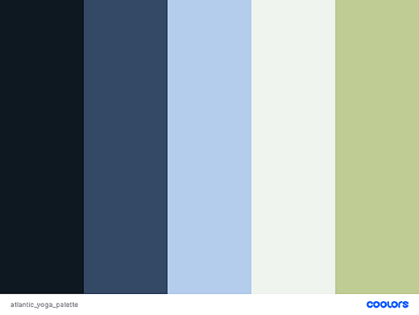

# Atlantic Yoga

## Author
Emma_Lawlor

## Project Overview
Atlantic Yoga is a site designed to bring together a yoga communtiy in the North Kerry area. It highlights the services prodived in a purpose-built yoga studio, located on the Wild Atlantic Way in Ballyheigue. The site is aimed at yogis of all levels who are looking for classes in their local community.

## Table of Contents

## UX

### Project Goals
#### As the site owner I want to:
- Provide the user with information on who we are, what we do & the services offered at the Atlantic Yoga studio.
- Provide the user with a detailed class schedule, to encourage all skill levels to join.
- Allow the user to sign up for a weekly neswletter, which will provide up to date information on a regular basis. Sign-up will be incentivised by offering a discount on classes. 
- Link social media accounts, for the user to stay in tuoch across a number of platforms. 

#### As the site user I want to:
- Learn about who Atlantic Yoga are and what services they provide.
- Learn of the benefits of practicing yoga.
- Find information on class schedule, price and skill level.
- Find out where the studio is located and how to contact Atlantic Yoga.
- Access the social media accounts for Atlantic Yoga.

### Design Choices

#### Typography

#### Colors

A color scheme of blues and green was chosen for the site as it ties in with the aesthetic of the location of the Atlantic Yoga studio; next to the Atlantic ocean in the South West of Ireland. The color palette also reflects the Home page hero image, creating a seamless appearance when landing on the site. 

*Color palette created on [Coolors](coolors.co)*

#### Images

### Wireframes
[Atlantic Yoga Wireframes](https://1drv.ms/b/s!AtrJulJDGsm2hwjXyLTFuNfaBSeT)

### Features

#### Navigation Bar
- Contains the Atlantic Yoga logo and links to Home, Classes and Contact pages.
- Features on all 3 pages to create a sense of familiarity and to allow the user to navigate the site easily without needing to use the browsers "back" button. 

#### Hero Image
- Image of yoga practice on the beach, tying together both the purpose of the site and the seaside location of the Atlantic Yoga studio.
- The colors of this hero image are in keeping with the overall color scheme of the site.

#### About Us Section
- This section introduces the user ot the Atlantic Yoga studio and the services provided. 
- The user will learn of the key benefits of practicing yoga, in an effort to encourage them to explore the classes available. 

#### Footer 
- Contains links to the Atlantic Yoga social media accounts in the form of icons for Youtube, Facebook, Instagram and Twitter.
- Links open in a new browser tab for enhanced user experience; the user will remain on the Atlantic Yoga site without needing to use the "back" button to return. 
- The footer is identical across all 3 pages of the site to maintain easeof navigation for the user and for aesthetic purposes. 

#### Class Schedule
- This section contains a clear and simple table detailing the current class schedule at the Atlantic Yoga studio.
- This information is vital for the user in determining which classes suit their needs. 
- The class schedule section will also give the user some practical information on attending classes at the studio, including a link to the location section of the contact page. 

#### Sign Up Form
- This form requires the user to provide their full name and email address in order to sign up for the Atlantic Yoga weekly newsletter.
- The user is encouraged to sign-up with the offer of a discount to use on their next class. 
- The sign-up function allows the site owner to stay in touch via email with their target audience.

#### Location Section 
- Provides the user with the information they need to both contact the studio and find it's location. 
- An embedded Google map gives the user specific address details. This clickable map opens in a new tab, allowing the user to find directions to the studio while remaining on the Atlantic Yoga site. 

## Credits

### Media
- Home page hero image was sourced from [pxhere.com](https://www.pxhere.com)
- Images on classes page and contact page taken from [pexels.com](https://www.pexels.com)
- Color scheme was generated on [coolors.co](https://www.coolors.co)
- Social media icons in footer were taken from [fontawesome.com](fontawesome.com)
- Wave icon in Logo was take from [flaticon.com](flaticon.com)

### Content
- Some content for "About Us" section adapted from [barefootyogastudio.ie](barefootyogastudio.ie)
- Content for benefits of yoga section adapted from [healthline.com](healthline.com)
- Benefits of yoga taken from [netdoctor.co.uk](netdoctor.co.uk)
- Types of yoga taken from [mindbodygreen.com](https://www.mindbodygreen.com/articles/the-11-major-types-of-yoga-explained-simply)

### Acknowledgements
- CSS grid layout was created with help from the following resources: 
  - Grid code generated on [CSS Grid Generator](https://cssgrid-generator.netlify.app/)
  - [CSS Grid cheat sheet](https://grid.malven.co/)
  - [A Complete guide to Grid](https://css-tricks.com/snippets/css/complete-guide-grid/)
  - [CSS grid footer](https://ewebdesigns.com.au/how-to-add-a-css-grid-footer-menu/)