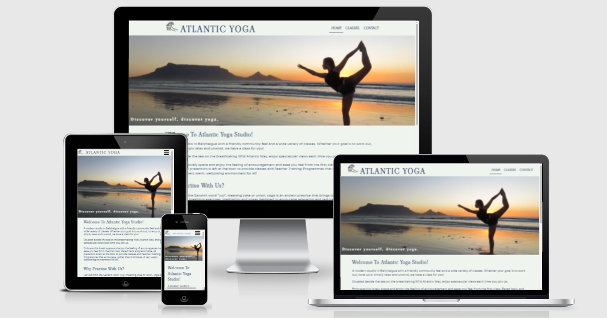
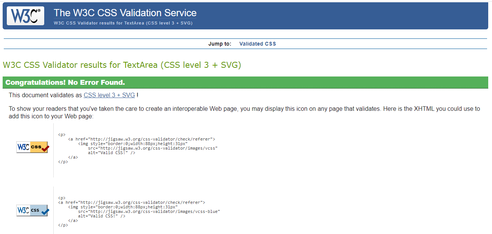
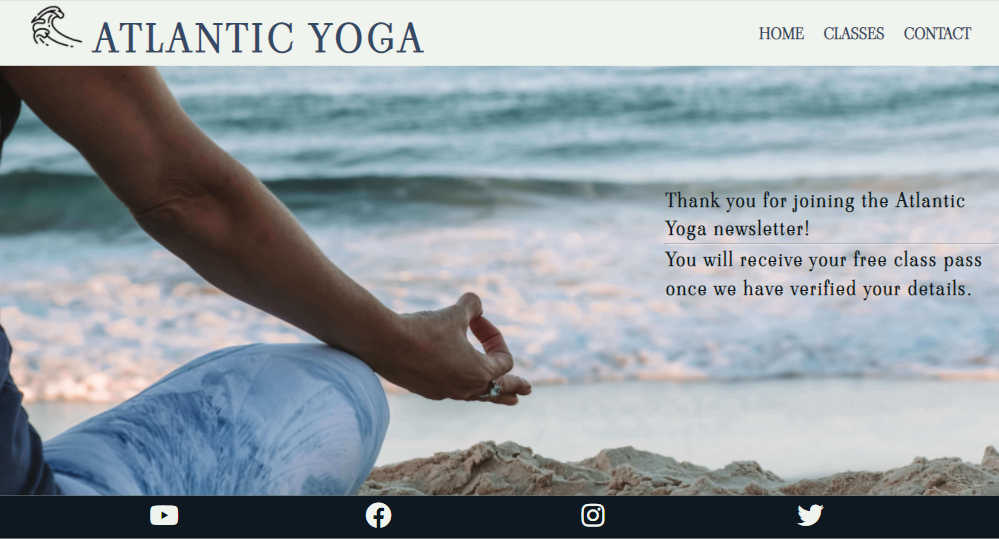

# Atlantic Yoga

[Link to deployed site](https://emmalawlor.github.io/atlantic_yoga/index.html)

## Author
Emma_Lawlor

---

## Project Overview
Atlantic Yoga is a site designed to bring together a yoga communtiy in the North Kerry area. It highlights the services prodived in a purpose-built yoga studio, located on the Wild Atlantic Way in Ballyheigue. The site is aimed at yogis of all levels who are looking for classes in their local community.

---

## Table of Contents

- [UX](#ux)
  * [Project Goals](#project-goals)
    + [As the site owner I want to:](#as-the-site-owner-i-want-to)
    + [As the site user I want to:](#as-the-site-user-i-want-to)
  * [Design Choices](#design-choices)
  * [Wireframes](#wireframes)
  * [Implemented Features](#implemented-features)
  * [Possible Future Features](#possible-future-features)
- [Testing](#testing)
  * [Validation Testing](#validation-testing)
    + [HTML](#html)
    + [CSS](#css)
  * [Manual Testing](#manual-testing)
  * [Cross Browser/Device Testing](#cross-browser-device-testing)
  * [Defects](#defects)
- [Accessibility](#accessibility)
  * [Keyboard Navigation](#keyboard-navigation)
  * [Screen Reader](#screen-reader)
- [Deployment](#deployment)
- [Credits](#credits)
  * [Media](#media)
  * [Content](#content)
  * [Acknowledgements](#acknowledgements)

---

## UX

---

### Project Goals
#### As the site owner I want to:
- Provide the user with information on who we are, what we do & the services offered at the Atlantic Yoga studio.
- Provide the user with a detailed class schedule, to encourage all skill levels to join.
- Allow the user to sign up for a weekly neswletter, which will provide up to date information on a regular basis. Sign-up will be incentivised by offering a discount on classes. 
- Link social media accounts, for the user to stay in tuoch across a number of platforms. 

#### As the site user I want to:
- Learn about who Atlantic Yoga are and what services they provide.
- Learn of the benefits of practicing yoga.
- Find information on class schedule, price and skill level.
- Find out where the studio is located and how to contact Atlantic Yoga.
- Access the social media accounts for Atlantic Yoga.

---

### Design Choices

- Typography
  - Atlantic Yoga logo and headings use Viaoda Libre from [Google Fonts](https://fonts.google.com/specimen/Viaoda+Libre?query=via)
  - All other text content uses Varela Round, also from [Google Fonts](https://fonts.google.com/specimen/Varela+Round?query=varela#standard-styles)
  - Fonts were chosen to compliment each other and both work well with the relaxed, informal feel of the site. 
  - A fallback font of sans-serif was used in case of any broswer compatability issues with chosen fonts.  

- Colors

  - A color scheme of blues and green was chosen for the site as it ties in with the aesthetic of the location of the Atlantic Yoga studio; next to the Atlantic ocean in the South West of Ireland. The color palette also reflects the Home page hero image, creating a seamless appearance when landing on the site. 
  - Whilst styling the site, I decided to omit the green colour which was originally a part of my colour palette as I did not think it suited the aesthetics of the page. 

*Color palette created on [Coolors](coolors.co)*

- Images
  - [Hero Image](https://github.com/EmmaLawlor/atlantic_yoga/blob/master/assets/images/hero-image.jpg) for Home page chosen as it ties in nicely with the theme of the site; a yoga studio by the sea. The image itself compliments the colour scheme running throughout the entire site. 
  - [Main Image](https://github.com/EmmaLawlor/atlantic_yoga/blob/master/assets/images/yoga-class.jpg) for Classes page as it visually suggests to the user what the page is about. The colours are quite neutral so as not to go against the site's colour scheme. 
  - [Main Image](https://github.com/EmmaLawlor/atlantic_yoga/blob/master/assets/images/yoga-group.jpg) on Contact page was again chosen to tie in with the theme of the page; getting in touch and communicating with Atlantic Yoga. 
  - [Main Image](https://github.com/EmmaLawlor/atlantic_yoga/blob/master/assets/images/error-image.jpg) on 404 error page chosen as it ties nicely with the overall theme and fits with the colour scheme of the site. The image is not too busy and does not distract the user from the text directing them back to the site's Home page. 
  - [Main Image](https://github.com/EmmaLawlor/atlantic_yoga/blob/master/assets/images/thankyou_page.jpg) on thank you page for form submission was chosen as the colours and content of the image tie in well with the overall look of the site. 
  - [Waves Icon](https://github.com/EmmaLawlor/atlantic_yoga/blob/master/assets/images/waves.png) used in Atlantic Yoga logo as it reflects the location of the studio and the theme of yoga by the sea. 

- Transitions/Animations
  - Hover transition added to social media links in footer to rotate 25 degrees clockwise and change colour to a light blue in keeping with the overall colour scheme of the site.  

---

### Wireframes
[Atlantic Yoga Wireframes](https://1drv.ms/b/s!AtrJulJDGsm2hwjXyLTFuNfaBSeT)

---

### Implemented Features

- Navigation Bar
  - Contains the Atlantic Yoga logo and links to Home, Classes and Contact pages.
  - Features on all 3 pages to create a sense of familiarity and to allow the user to navigate the site easily without needing to use the browsers "back" button. 

- Hero Image
  - Image of yoga practice on the beach, tying together both the purpose of the site and the seaside location of the Atlantic Yoga studio.
  - The colors of this hero image are in keeping with the overall color scheme of the site.

- About Us Section
  - This section introduces the user ot the Atlantic Yoga studio and the services provided. 
  - The user will learn of the key benefits of practicing yoga, in an effort to encourage them to explore the classes available. 

- Footer 
  - Contains links to the Atlantic Yoga social media accounts in the form of icons for Youtube, Facebook, Instagram and Twitter.
  - Links open in a new browser tab for enhanced user experience; the user will remain on the Atlantic Yoga site without needing to use the "back" button to return. 
  - The footer is identical across all 3 pages of the site to maintain easeof navigation for the user and for aesthetic purposes. 

- Class Schedule
  - This section contains a clear and simple table detailing the current class schedule at the Atlantic Yoga studio.
  - This information is vital for the user in determining which classes suit their needs. 
  - The class schedule section will also give the user some practical information on attending classes at the studio, including a link to the location section of the contact page. 

- Sign Up Form
  - This form requires the user to provide their full name and email address in order to sign up for the Atlantic Yoga weekly newsletter.
  - The user is encouraged to sign-up with the offer of a discount to use on their next class. 
  - The sign-up function allows the site owner to stay in touch via email with their target audience.

- Location Section 
  - Provides the user with the information they need to both contact the studio and find it's location. 
  - An embedded Google map gives the user specific address details. This clickable map opens in a new tab, allowing the user to find directions to the studio while remaining on the Atlantic Yoga site. 

- 404 Error Page
  - Included to improve user experience should they encounter a 404 error while using the site. 
  - The [image](https://github.com/EmmaLawlor/atlantic_yoga/blob/master/assets/images/error-image.jpg) used again reinforces the message of the site; yoga by the sea. 
  - The page features a simple Atlantic Yoga at the top which functions as a link back to the Home page.
  - A text overlay at the bottom of the main image also features a link directing the user back to the main page as well as informing the user that something has gone wrong. 

- Thank You Page 
  - User is directed to this page in a new tab after successfully completing the newsletter sign-up form on the Contact page. 
  - This page contributes to user experience by both confirming that their form submission was successful and that their free gift is on the way. 
  - The page is designed in a simple layout, featuring the common logo, navigation bar and footer that features across all pages pf this site. This again adds to the user experience by creating a sense of familiarity on the site and allowing for simple navigation back to the main content. 
  - The [image](https://github.com/EmmaLawlor/atlantic_yoga/blob/master/assets/images/thankyou_page.jpg) used on the page features colours in keeping with the main Atlantic Yoga palette. 

### Possible Future Features
- Thank You Message
  - Using Javascript, the sign-up form container would display a thank you message and confirmation of form submission when the user successfully submits their details.
  - This would eliminate the need for the separate confirmation page ('thankyou.html').
- Class Booking Feature
  - This would allow the user to book in for a class directly from the "Classes" page of the site without needing to contact the studio directly. 
  - Simplifying the class booking process in this way would benefit both the site user and owner. 

---

## Testing

### Validation Testing 

#### HTML
All html pages of the site were validated using [W3C Validator](https://validator.w3.org/)
- *Home Page* passed through the validator with no issues 

- *Classes Page* returned the following warnings 

  
  These warnings were caused by the Class Schedule table which had some rows with 1 column and other rows with 3 columns. This was corrected by adding extra columns to the rows originally containing 1 column as shown:

After making these changes, the Classes page then passed through the validator with no further issues:

- *Contact Page* passed through the validator with no issues

- *Thank You Page* returned the following error when passed through the validator 

  
  This error was corrected by changing the text to 2 separate h2 elements, with a hr between the 2 as follows:

After making this change, the page then passed through the validator with no further issues 

- *404 error page* returned the following warning

  This warning was corrected by changing the image tect to a h2 element as shown

After making this change the page then passed through the validator with no further issues

#### CSS

CSS stylesheet was validated using [W3C Validator](https://jigsaw.w3.org/css-validator/)

- The first error returned related to the logo in the navigation header

  This was corrected by changing margin-left to contain only 1 value as follows 

- The next error encountered related to the links in the *class info* section of the Classes page which had an invalid value for bottom border, caused by an unneccessary space

  This was corrected by deleting the space in the border-bottom property as follows

- The final error encountered related to an invalid value for the padding property of a form input, caused by mis-typing the px value 

  This was corrected by fixing the px value for the padding property as follows

- The validator also returned a warning for the links in the *class info* section of the classes page, caused by having the same value for background-color and border-bottom-color

  This was corrected by removing the border-bottom property from the links. This property was not required as the links are styled with a text-decoration set to underline.

- After solving all of these errors and warning the CSS then passed through the validator with no further issues 

### Manual Testing

Manual testing of all site feature was carried out on a number of devices and browsers as detailed in [this document](https://docs.google.com/spreadsheets/d/1kLFF4x3FpBf6uUvAs_ApKA7Rbxo-KQ75rFad1MKxBV8/edit?usp=sharing)

*Preview*

### Cross Browser/Device Testing

The site was tested across a number of devices and browsers to ensure all elements function correctly and appear as expected. The browsers and devices tested are as follows:

| TOOL / Device                   | BROWSER     | OS         | SCREEN WIDTH  |
|-------------------------------  |-------------|------------|---------------|
| real phone: iPhone8             | safari      | iOs        | XS 375 x 667  |
| real phone: iPhone11            | safari      | iOs        | XS 414 x 896  |
| real phone: samsung galaxy s10  | chrome      | android    | XS 360 x 740  |
| real tablet: ipad Air 2         | safari      | iOs        | M 768 x 1024  |
| real computer: toshiba laptop   | chrome      | windows 10 | XL 1366 x 768 |
| real computer: toshiba laptop   | firefox     | windows 10 | XL 1366 x 768 |
| real computer: dell desktop     | chrome      | windows 10 | XL 1920 x 1080|
| dev tools emulator: iPhone5s    | safari      | iOs        | XS 320 x 568  |
| dev tools emulator: ipad pro    | safari      | iOs        | L 1024 x 1366 |
| dev tools emulator: MS lumia550 | edge        | windows    | XS 360 x 640  |

### Defects

#### Defects of Note
Whilst testing the site I encountered the following issues:

- The footer on the 404 error page displayed as a black bar of colour, without the social media icons displayed on all other pages as shown here

  
  After reviewing both my html and css code, I discovered I had omitted the script for the fontawesome social media icons from my html. Adding the script displyed the footer as expected, as seen here:

- When viewing the *Contact page* on smaller devices, there was a large section of empty space between the main image and the sign-up form container, as seen here:

  Using Chrome DevTools hightlighted that a large margin value on the image container was causing the empty space on smaller screen widths. This was corrected by adding a media query for small screens, minimising margin to improve the look of the page with the following result: 
  

- The form sign-up *thank you* page displayed a large portion of white space below the footer as seen here

  This bug was fixed by adding a height property to both the *thankyou-container* and *thankyou-image*. The value of this property was set to full viewport height minus the height of navigation bar and footer combined. This value varied at smaller screen sizes so a number media queries were used to ensure the defect was corrected across all devices. A sample of the height property/value used can be seen here 

After applying this solution at various screen widths, the page displays as desired on all devices, as seen below

#### Outstanding Defects
- White space at the bottom of the 404 error page, below footer as shown below. Given more time, the image would height would be adjusted to eliminaate this. 

## Accessibility

### Keyboard Navigation
Verified that all pages of the site are compatible with keyboard navigation by using the tab, enter and arrow keys to move through the website. 
*Testing conducted on 07/07/21*

### Screen Reader
Verified that a screen reader can read the website including descriptions of links an images using Google Chrome screen reader extension. 
*Testing conducted on 07/07/21*

---

## Deployment
The site was deployed from its [GitHub Repository](https://github.com/EmmaLawlor/atlantic_yoga) to GitHub Pages using the folling steps: 

- From the Atlantic yoga repository, select the Settings tab.
- Select the Pages sub-menu on the left of the page.
- Under Source, select the Master branch and hit save.
- Upon saving, the page refreshes to confirm deployment of site and provides link to [live site](https://emmalawlor.github.io/atlantic_yoga/).

---

## Credits

### Media
- Home page hero image was sourced from [pxhere.com](https://www.pxhere.com)
- Images on classes page and contact page taken from [pexels.com](https://www.pexels.com)
- Error page image taken from [Unsplash](https://unsplash.com/photos/IGOBsR93I7Y)
- Color scheme was generated on [coolors.co](https://www.coolors.co)
- Thank you page main image taken from [Unsplash](https://unsplash.com/photos/n8L1VYaypcw)
- Social media icons in footer were taken from [fontawesome.com](fontawesome.com)
- Waves favicon generated on [favicon.io](https://favicon.io/)
- Wave icon in Logo was take from [flaticon.com](flaticon.com)
- Yoga pose icon on Home page and lotus flower icon on classes page both taken from [flaticon.com](flaticon.com)
- All image file sizes compressed using [TinyPNG](https://tinypng.com/) to allow for faster loading of images on the site
- Embedded location map taken from [Google Maps](https://www.google.com/maps/place/Community+Centre/@52.3902211,-9.836798,15z/data=!4m12!1m6!3m5!1s0x485ab69a4631c2cd:0xe6fe6612834ded39!2sCommunity+Centre!8m2!3d52.3883774!4d-9.8338019!3m4!1s0x485ab69a4631c2cd:0xe6fe6612834ded39!8m2!3d52.3883774!4d-9.8338019)
- Image of responsive site used for readme created using [Am I Responsive](http://ami.responsivedesign.is/)

### Content
- Some content for "About Us" section adapted from [barefootyogastudio.ie](barefootyogastudio.ie)
- Content for benefits of yoga section adapted from [healthline.com](healthline.com)
- Benefits of yoga taken from [netdoctor.co.uk](netdoctor.co.uk)
- Types of yoga taken from [mindbodygreen.com](https://www.mindbodygreen.com/articles/the-11-major-types-of-yoga-explained-simply)

### Acknowledgements

- CSS grid layout was created with help from the following resources: 
  - Grid code generated on [CSS Grid Generator](https://cssgrid-generator.netlify.app/)
  - [CSS Grid cheat sheet](https://grid.malven.co/)
  - [A Complete guide to Grid](https://css-tricks.com/snippets/css/complete-guide-grid/)
  - [CSS grid footer](https://ewebdesigns.com.au/how-to-add-a-css-grid-footer-menu/)
  - [Auto-sizing columns](https://css-tricks.com/auto-sizing-columns-css-grid-auto-fill-vs-auto-fit/)
  - Code for hamburger menu on navigation bar adapted from [Modern-CSS](https://www.modern-css.com/responsive-navbar-with-css-grid.html)
  - Help in writing some sections of CSS found on [W3schools](https://www.w3schools.com/css/default.asp) 
  - Table of contents for this readme file generated on [https://ecotrust-canada.github.io/markdown-toc/](https://ecotrust-canada.github.io/markdown-toc/)

- Whilst troubleshooting when writing my code I sought help from the following:
  - [StackOverflow](https://stackoverflow.com/)
  - [W3Schools](https://www.w3schools.com/)
  - My peers at Code Institute Room on [Slack](https://slack.com/intl/en-ie/)
  - Tutor support from Code Institute

- [Manual testing document](https://docs.google.com/spreadsheets/d/1kLFF4x3FpBf6uUvAs_ApKA7Rbxo-KQ75rFad1MKxBV8/edit?usp=sharing) adapted from template provided by my mentor Malia Havlicek

### Thank You

- Thanks to my cohort facilitator Kasia for directing me to resources for CSS grid and creation of 404 error page. 
- Thanks to my peers on Slack for their advice, help and feedback. 

- Special thanks to my mentor Malia for her invaluable tips, resources and feedback.
